<!-- ===================== HEADER ===================== -->

# 👋 Hello! I'm Kazi

### 💻 Software Developer | 🔐 Cybersecurity & IT | 🎮 Computer Graphics | 🤖 Embedded Systems

🎓 **Computer Science Graduate**

I enjoy building software, experimenting with hardware, creating graphics,  
and solving real-world technical problems.

🚀 **Always learning. Always building.**

---

## 👨‍💻 About Me

I'm a **Computer Science graduate** with interests across software development, cybersecurity, computer graphics, embedded systems, and information technology.

I enjoy turning ideas into working projects — whether that means developing an application, programming a 3D environment, working with a Raspberry Pi, or troubleshooting computer systems. 🛠️

- 💻 Interested in **Software Engineering & Development**
- 🔐 Interested in **Cybersecurity & Information Technology**
- 🎮 Enjoy working with **Computer Graphics & Game Development**
- 🤖 Experienced with **Arduino & Raspberry Pi**
- 🧠 Developed software for **psychological research**
- 🛠️ Experienced with **technical support & troubleshooting**
- 🌱 Continuously learning new technologies
- 🔎 Currently seeking **entry-level opportunities in Computer Science and IT**

---

## 🛠️ Technologies & Skills

### 👨‍💻 Programming Languages

`C++` • `C#` • `Python` • `JavaScript` • `SQL`

### 🌐 Web Development

`HTML` • `CSS` • `JavaScript` • `React`

### ⚙️ Software Development

`.NET` • `Visual Studio` • `Git` • `GitHub`

### 🎮 Graphics & Game Development

`OpenGL` • `Unity` • `Unreal Engine`

### 🗄️ Databases

`SQL` • `SQLite`

### 🤖 Embedded Systems & Hardware

`Arduino` • `Raspberry Pi` • `Sensors` • `Hardware Integration`

### 🔐 IT & Cybersecurity

`Computer Troubleshooting` • `Hardware Support` • `Software Support`  
`Networking` • `System Configuration` • `Cybersecurity Fundamentals`

---

## 🚀 Featured Areas of Work

### 🧠 Research Software

Developed **C# and Python applications** for psychological research and experimental data collection.

My work involved creating software that helped researchers conduct experiments and collect useful research data.

---

### 🎮 Computer Graphics

Built graphics projects using **C++ and OpenGL**.

Worked with:

- 🌎 3D environments
- 🧊 3D models
- 💡 Lighting
- 🎨 Textures
- 🌌 Skyboxes
- 📷 Camera movement
- 🕹️ Interactive graphics

---

### 🤖 Embedded Systems

Worked with **Arduino and Raspberry Pi** to explore the connection between software and physical hardware.

Projects involved:

- 🔌 Hardware integration
- 📡 Sensors
- 💻 Programming
- ⚙️ Embedded systems
- 🧪 Experimentation and prototyping

---

### 🌐 Web Development

Built responsive websites and web applications using modern web technologies.

My personal portfolio is also hosted using **GitHub Pages**. 🚀

---

## 🎯 What I'm Interested In

I'm currently interested in opportunities involving:

💻 **Software Engineering & Development**

🔐 **Cybersecurity & Information Technology**

🎮 **Computer Graphics / Game Development**

🤖 **Embedded Systems & IoT**

🧠 **Research Software Development**

🛠️ **Technical Support & Systems**

---

## 📚 Currently Learning & Improving

I'm continuously expanding my knowledge through projects and hands-on experimentation.

🌱 Improving my software engineering skills  
🔐 Learning more about cybersecurity and networking  
🎮 Exploring graphics and game-development technologies  
🤖 Building experience with hardware and embedded systems  
🧩 Practicing problem solving and software design

---

## 💡 My Approach

> 💭 **Learn by building. Improve by experimenting. Solve problems by understanding how things work.**

I believe some of the best learning happens when you actually build something, encounter a problem, and figure out how to solve it. 🧠💡

---

## 🤝 Let's Connect!

I'm always interested in connecting with developers, IT professionals, researchers, and people working on interesting technology. 🌎

💼 **LinkedIn:** [Connect with me](YOUR-LINKEDIN-URL)

🌐 **Portfolio:** [Visit my Portfolio](YOUR-PORTFOLIO-URL)

📧 **Email:** YOUR-EMAIL

---

### 👀 Thanks for visiting my GitHub!

Feel free to explore my repositories and projects. 🔍

⭐ If you find something interesting, feel free to **star the repository!**

🤝 I'm also open to **collaboration, feedback, and learning from other developers.**

 

### 💻 Keep Learning • 🚀 Keep Building • 🧠 Keep Exploring

